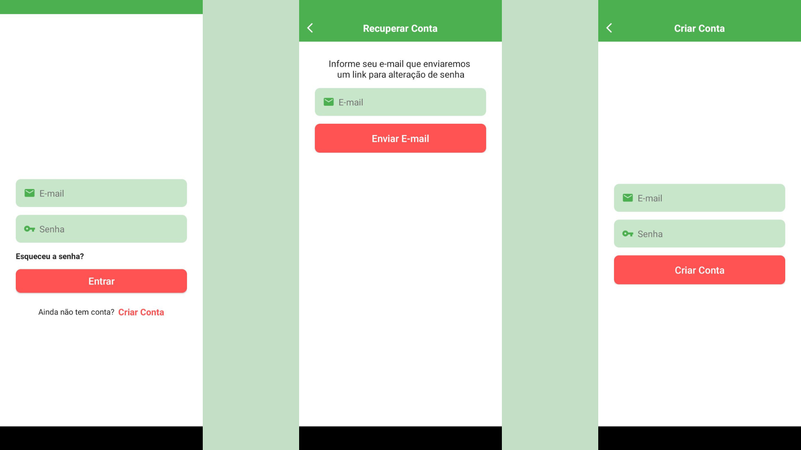
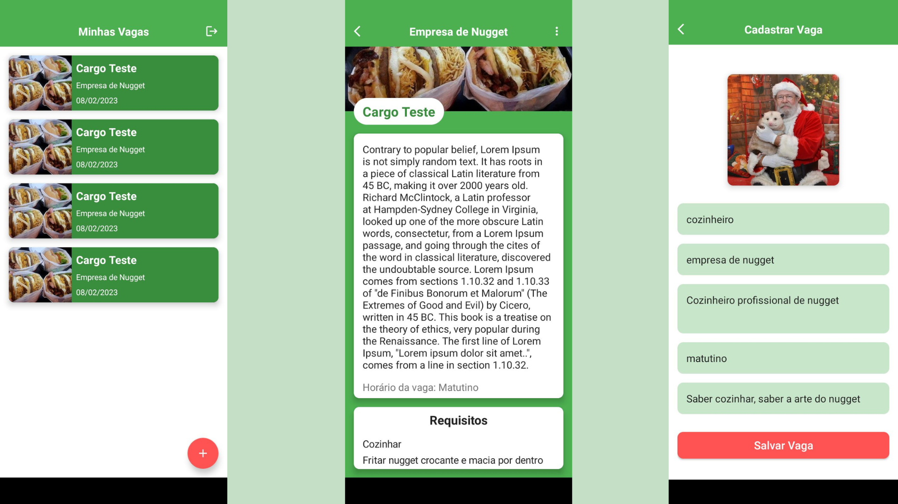
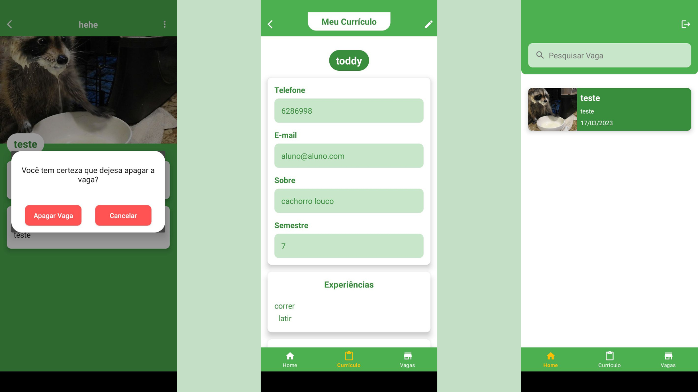
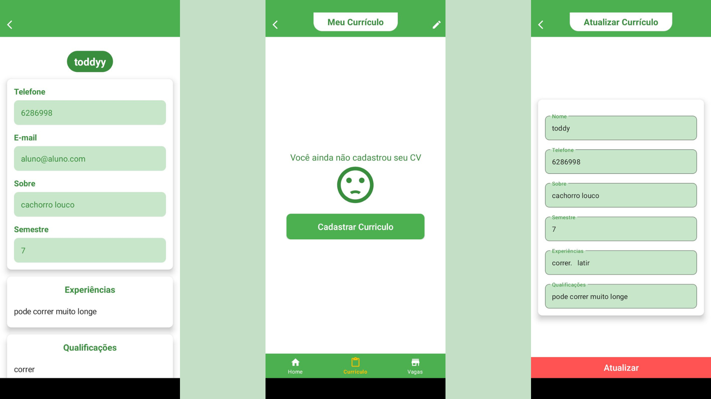
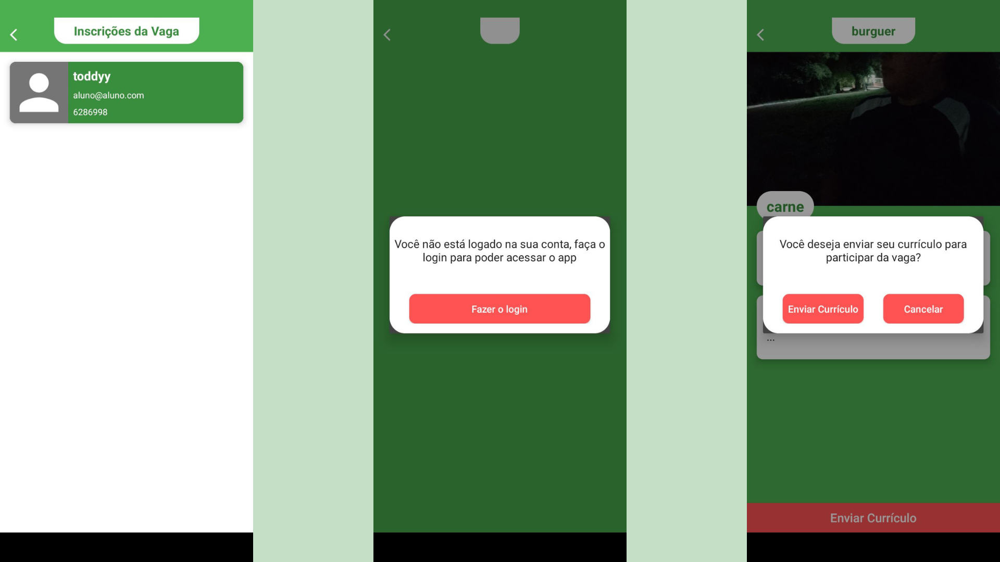
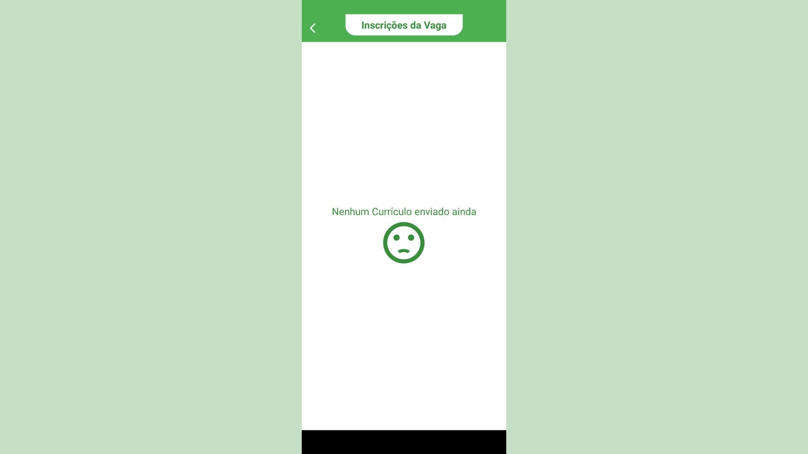

# Vagas IFB

## Sobre o Projeto
Criação de App para publicação de vagas para alunos de gastronomia do IFB, sendo possível tanto a visualização e aplicação da vaga por parte do aluno quanto publicação e analise de CV por parte do anunciante. Foi utilizado o firebase para o armazenamento de imagens e de dados de vagas e estudantes e autentificação. As imagens pode ser selecionadas tanto pela câmera quanto pela galeria do dispositivo.

## Tecnologias Utilizadas
### Mobile
- Kotlin

## Backend
- Firebase

# Layout Mobile
### Login / Recuperar conta / Criar conta

### Minhas vagas / Dados da vaga/ Cadastrar vaga

### Dialogo de alerta / Currículo do estudante/ Tela de Home do estudante

### Meu currículo / Currículo não cadastrado / Atualizar currículo

### Tela do ofertante da vaga mostrando inscrições da vaga / Dialogo de aviso / Aviso se deseja participar da vaga

### Tela de inscrições da vaga
